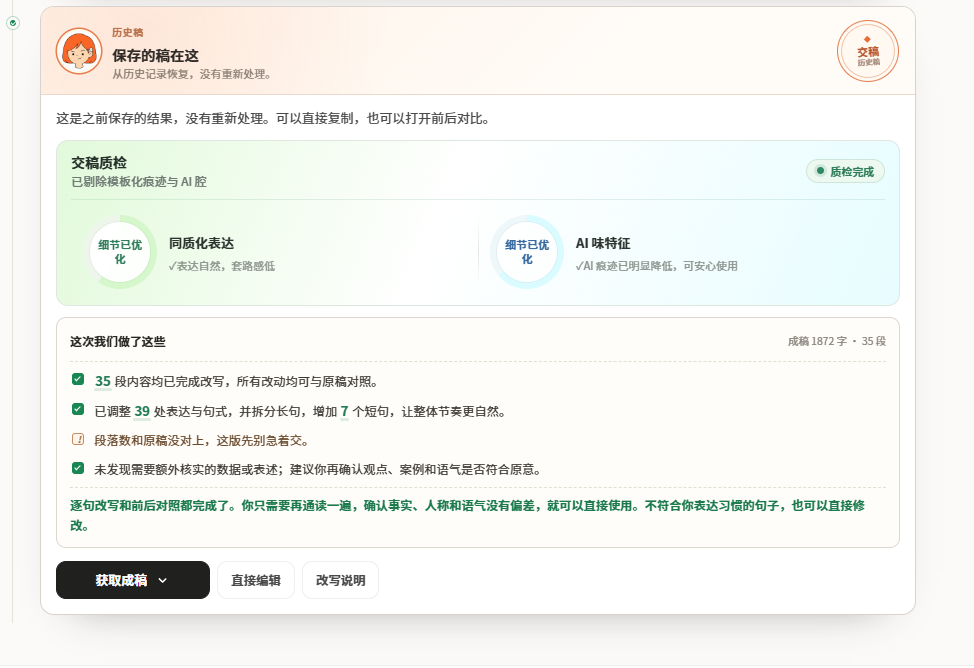

# 稿子AI味洗不掉？手把手教你去除AI写作痕迹，秒变真人原创稿

很多同时运营多个账号的自媒体人，都会用 **AI 帮忙搭初稿**、整理素材，效率确实高了不少。但稿子一多，另一个问题也很明显：不同账号发出来的内容越来越像，**AI 痕迹**也比较重。

为了**去除 AI 写作痕迹**，我以前也没少搜**去 AI 味网站**、收藏各种**ai改写指令**，甚至试过不少**去ai味免费工具**。后来才发现，单纯换词、调语序其实解决不了根本问题。想弄清楚**怎么消除 ai 写作痕迹**，重点还是得从文章结构、句式节奏和个人表达这几个地方下手。

## 一、先别急着换词，AI 味往往藏在文章结构里

我刚开始**改 AI 稿**时，最喜欢做的一件事就是批量替换近义词。改完之后，表面上的文字确实变化很大，但从头读到尾，还是能感觉到一股明显的机器感。

后来仔细对比才发现，问题不一定出在某一个词，而是整篇文章太“整齐”了：

- 段落长度比较平均；

- 每段都按照固定逻辑展开；

- 观点一个接一个排列；

- 过渡特别顺，几乎没有停顿；

- 总结、升华、提出建议的套路反复出现。

真人写东西反而没这么标准。有时候一个观点会多聊两句，有时候突然插入自己的经历，长句和短句也不会排列得特别规整。

所以真正做好**去除 AI 写作痕迹**，并不是把每个词都换掉，而是让文章重新有自己的节奏和表达习惯。

## 二、再看句子：这些模板化表达特别容易让文章变“AI味”

除了整体框架，句式也是很明显的一层。

比如一篇稿子里反复出现“首先、其次、最后”“不是……而是……”“从根本上来说”“值得注意的是”这类表达，单独看没有什么问题，但大量集中出现，就很容易让文章显得像套模板。

排比句也是类似的问题。**AI 生成稿子**很容易把一句普通的话扩成三四个结构相似的句子，语法看着没错，读起来却特别规整。

我的处理方式一般不是全部删掉，而是结合上下文重新组织。有些过渡直接删掉，有些长句拆开，有些重复观点合并，再把自己的经历、观察和具体案例补进去。

这样做之后，文章不会只是“换了一批词”，而是整体读感都发生变化。

## 三、实测工具方案：小橡皮 AI，解决稿件机器味难题

批量处理多篇稿件之后，对比过不少工具，我日常会用**小橡皮 AI **做初稿润色，属于个人自用体验分享。 

传送门：[小橡皮](https://xiangpiai.cn/workspace?from=github0901jw)[https://xiangpiai\.cn/](https://xiangpiai.cn/workspace?from=github0901jw)

不少** AI 初稿**会生成这类书面化句子：“通过合理运用相关工具，可以有效提升内容创作效率，同时降低人工修改成本。” 语法没有任何错误，但满是工具书面腔。 经过改写之后可以变成很贴合博主分享的口吻：“找对合适的工具，能帮我们省下不少改稿时间。” 同样的意思，阅读感受却差别很大。

**小橡皮 AI **的「一键变人味」功能，专门处理这种内容没问题，但表达极度模板化的文稿，弱化稿件的**AI 痕迹**。 如果只运营单个账号，体感提升不算特别明显；做多账号分发的创作者会觉得很实用。小红书、公众号、抖音、知乎各自的表达语境不一样，同一篇原稿直接复制分发，很容易出现内容同质化，带来限流隐患。工具可以切换不同平台文风，同一套选题快速做多版本适配，省下大量重复改写时间。

改写过程中每一处改动全部可视化，能够看到修改位置和优化说明。遇到不符合自己表达习惯的地方，可以直接撤回手动调整，不会把所有稿件改成一模一样，能够保留账号独有的表达风格。

还有一个容易被忽略的防限流能力。有时候明明做完**去除 AI 写作痕迹**，发出去依旧流量低迷，根源往往是人眼很难全部揪出来的隐性极限词、营销话术。改写完成之后开启风控扫描，标记潜在风险表述，对于经常写推广向文案的创作者十分实用。

## 四、工具改完别直接发，最后这一步还是得自己做

工具再方便，也不建议改完就直接发布。尤其是批量产出内容时，自己最后通读一遍很有必要。

我一般会重点检查三个问题：

**第一，这句话像不像自己平时会说的话？**
如果读起来特别书面或者特别“标准”，就重新改一下。

**第二，这一段真的有必要吗？**
如果只是为了凑篇幅，没有提供新的信息，可以直接删掉。

**第三，里面有没有自己的东西？**
自己的经历、踩过的坑、具体案例、真实感受，这些才是文章和普通模板稿最大的区别。

如果一篇文章从头到尾只有标准答案，没有个人观察和具体细节，那么即使语言润色得很顺，也很难形成真正属于自己的风格。

## 最后总结

**AI 写作**很适合拿来做选题整理、素材归纳和初稿搭建，真正容易出问题的是**AI 产出初稿 → 不修改 → 直接发布**。

我现在比较固定的流程是：

**AI 搭初稿 → 工具处理模板化表达 → 补充个人经历和观点 → 删除重复内容 → 人工通读 → 最后发布**

尤其是需要批量做内容的时候，可以先让工具完成基础处理，再自己花一点时间调整重点段落。这样既能提高效率，也不会让所有账号的内容都变成一个模样。

所谓**怎么消除 ai 写作痕迹**，我现在更倾向于理解成：不是把文字改得越来越复杂，而是把空话、套话删掉，把真正属于自己的观点、经历和表达留下来。

